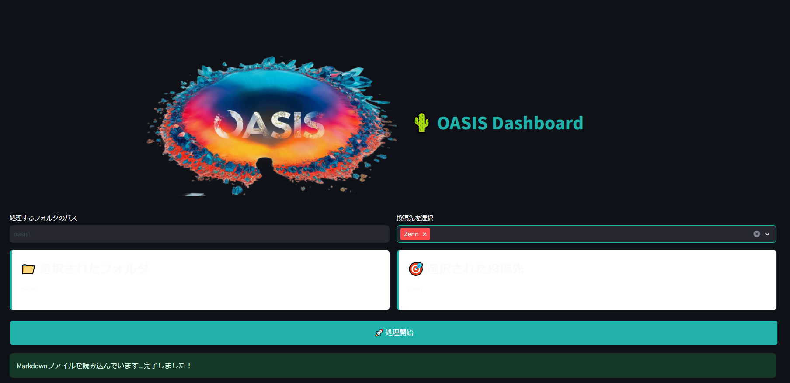

IT関連の記事を中心に執筆しているので、複数のプラットフォームに投稿してもいいかなと~~コスいことを~~考え、Note、Qiita、Zennにクロス投稿する方法を調べてみました。

## OASISというツールについて

OASISというクロス投稿ができるツールがありました。手順を示します。

## クロス投稿の手順

1. OASISのインストール
2. 設定ファイルの作成
3. Markdown形式で記事の作成
4. 投稿の実行

### 1. OASISのインストール

以下のコマンドを実行して、OASISをインストールします。

```
pip install -U oasis-article
```

### 2. 作業フォルダと設定ファイルの作成

作業フォルダとしてユーザフォルダの下にoasisを作成しました。

次にOASISの設定ファイル `.env` を作成します。作業フォルダではなくユーザフォルダの下に作成しました。このファイルには、各プラットフォームへの認証情報や設定を記載します。

#### LLM設定

```
LLM_MODEL=gemini/gemini-1.5-flash
GEMINI_API_KEY=Google AI Studioから取得したAPI KEYを入力
```

※LLMのAPI設定が必須でした。デフォルトだとgemini/gemini-1.5-pro-latestのようですが安価なflashを指定しました。

※OpenAIのAPIを指定したかったのですがそれっぽい指定をしてもAPIのエントリポイントが404になってしまうためgeminiに戻しました。


#### Note用設定

```
NOTE_EMAIL=メールアドレスを入力
NOTE_PASSWORD=パスワードを入力
NOTE_USER_ID=ユーザIDを入力
```

#### Qiita用設定

```
QIITA_TOKEN=Qiitaトークンを入力
```


#### Qiitaトークン取得方法

Qiita→設定→アプリケーション→個人用アクセストークン→新しくトークンを発行する→アクセストークンの発行→

アクセストークンの説明(今回は投稿用と入れました)を入れてwrite_qiitaにチェックを入れる→発行する→アクセストークンをコピーする


#### Zenn用設定

Zennに投稿するにはZennとGithubの連携をする必要があります。

詳細は[親切なサイト](https://zenn.dev/youliangdao/articles/zenn-article-setup-local)に譲ります。

※Zennに関してはoasisが投稿するのではなく投稿用のmdファイルが作成されます。そのmdファイルを手動でGithubにpushしてZennに反映させます。

※Githubと連携するフォルダはc:\prj\の下をおすすめします。

#### Firefox設定

※これも必須設定です。

```
FIREFOX_BINARY_PATH="C:\Program Files\Mozilla Firefox\firefox.exe"
FIREFOX_PROFILE_PATH="C:\Users\your_user_name\AppData\Roaming\Mozilla\Firefox\Profiles\your_profile_name"
```

### 3. Markdown形式で記事の作成

記事はMarkdown形式で記述する必要があります。慣れないうちはベタテキストで書き、ChatGPTなどに校正がてらMarkdownに変換してもらっても良いと思います。(何度か記事を書いているうちによく使うタグは覚えます)

### 4. 投稿の実行

準備が整ったら、ユーザフォルダからoyasisを起動しWebUIを呼び出します。

```
oasis -app
```



処理するフォルダのパスに投稿用mdファイルがあるパスを指定しました。

投稿先を選択後、処理開始をクリックします。

Noteはこれで投稿できました。FirefoxをSeleniumでコントロールしているようなので投稿が終わるまで画面は触らないほうが良いです。

Zennの場合はC:\Prj\Zenn\articlesに投稿用mdファイルが生成される(--zenn-output-pathでアウトプットパスを指定しましたがWebUIでは有効ではないようです)のでZennと連携したGithubにpushすると反映されます。

Qiitaは投稿完了の表示が出ても投稿されず、この原稿を書いている時点で問題を解決できませんでした。後日、解析しようと思います。

またNoteとZennで画像の貼り付けが反映されないため、手動で直しています。

## 追記：WordPressについて

OasisはWordPressにも投稿できるようですが、WordPressを使えるサーバを持っていないため試せませんでした。
